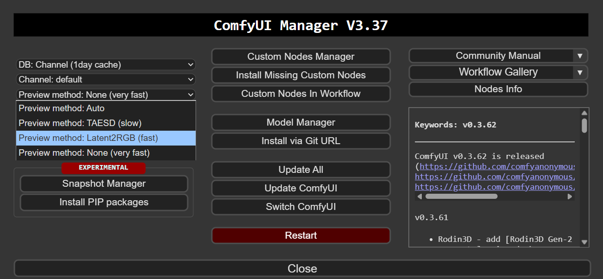
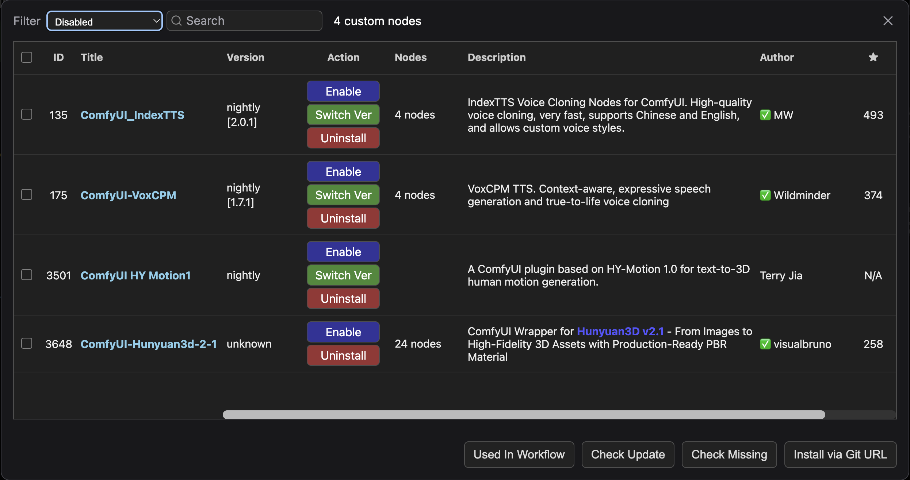
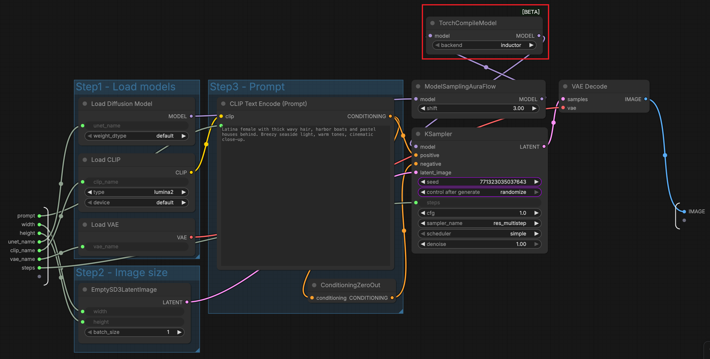
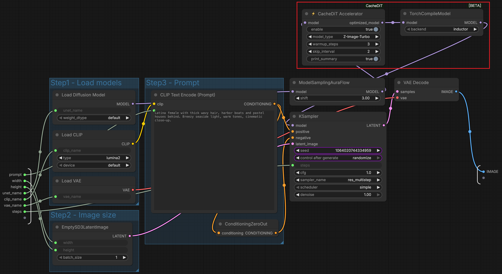
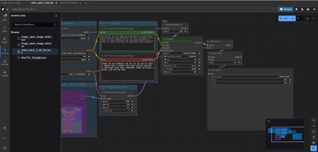
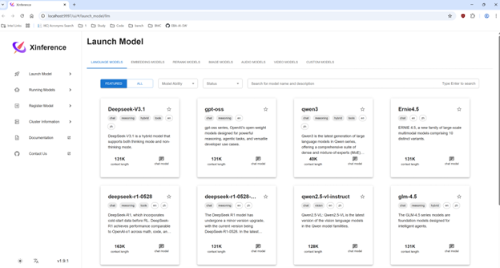
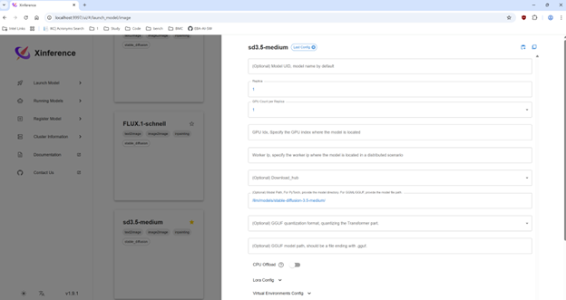
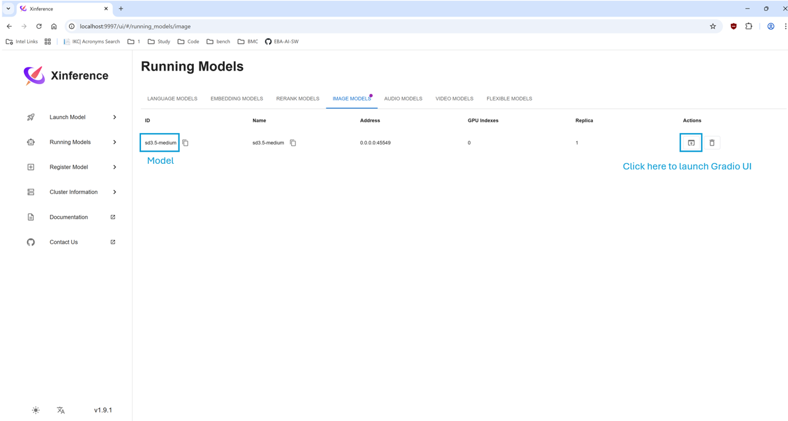
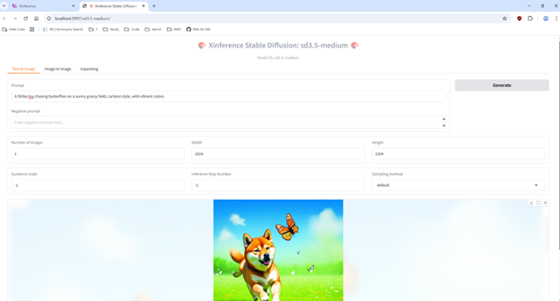

# llm-scaler-omni

---

## Table of Contents

1. [Getting Started with the ComfyUI Image](#getting-started-with-the-comfyui-image)
2. [ComfyUI](#comfyui)
3. [SGLang Diffusion (full image only)](#sglang-diffusion-experimental)
4. [XInference (full image only)](#xinference)
5. [Stand-alone Examples](#stand-alone-examples)
6. [ComfyUI for Windows (experimental)](#comfyui-for-windows-experimental)

---

## Getting Started with the ComfyUI Image

The default Dockerfile is single-device ComfyUI-focused. It excludes
Xinference, SGLang/SGLDiffusion, and the disabled audio/3D node bundle.
Raylight and its xDiT-based multi-XPU ComfyUI integration have been removed
from both image flavors.
The former all-in-one development image remains available as the optional
`full` flavor.

Pull a published image from Docker Hub:

```bash
docker pull intel/llm-scaler-omni:0.1.0-b7
```

Build the default ComfyUI flavor:

```bash
# Arc B-series / Battlemage
XPU_TARGET=bmg bash build.sh

# Panther Lake H / Arc B390
XPU_TARGET=ptl-h bash build.sh
```

Build the optional full flavor only when Xinference or SGLang is required:

```bash
OMNI_IMAGE_FLAVOR=full XPU_TARGET=ptl-h bash build.sh
```

`XPU_TARGET` is the single device selector for the Omni core, LGRF, and CUTE
native builds. Valid values are `bmg` and `ptl-h`; `OMNI_XPU_DEVICE` remains a
compatible alias. The build rejects other targets before compilation.

The focused image fetches the pinned SYCL-TLA/CUTLASS headers directly instead
of obtaining them as a side effect of an SGL kernel build. Omni native
extensions are AOT-compiled for the selected device and the build verifies
that the package and compiled-core target markers match.

Local images include both flavor and device in the tag, for example:

- `intel/llm-scaler-omni:0.1.0-b9-dev-comfyui-bmg`
- `intel/llm-scaler-omni:0.1.0-b9-dev-comfyui-ptl-h`
- `intel/llm-scaler-omni:0.1.0-b9-dev-full-ptl-h`

For the focused image, `build.sh` also records the full `llm-scaler` Git
revision and whether the `omni/` worktree was dirty. These values are exposed
as OCI labels and `OMNI_LLM_SCALER_SOURCE_*` environment variables; release
acceptance rejects an unknown revision or dirty source by default.

The builder and final image both use
`intel/omix:0.1.0-devel-ubuntu24.04`; the final image retains `/opt/venv`,
the `/llm` source/build trees, `/wheels`, and the oneAPI compiler so native
kernels can be rebuilt in place. Set `MAX_JOBS` or `OMNI_BASE_IMAGE` to
override those defaults. `INSTALL_DISABLED_NODES` applies only to the full
flavor.

The Kitchen XPU integration is pinned to
`xiangyuT/comfy-kitchen-xpu@acdf65deace1b0ca3b436f45e560ed44f0c0d08f`
(`comfy-kitchen==0.2.18`, the XPU-enabled `main` merge based on upstream `0.2.18`) and is installed
after third-party requirements so
ComfyUI's older transitive pin cannot replace it. Its repository, commit, and
version can be overridden together with `COMFY_KITCHEN_REPOSITORY`,
`COMFY_KITCHEN_COMMIT`, and `COMFY_KITCHEN_VERSION` for a deliberate upgrade.

### Docker Build Cache Layout

The focused Dockerfile keeps frequently edited native projects on independent
BuildKit branches:

- `os-base` and `python-base`: stable OS, Torch XPU, and oneDNN dependencies;
- `comfyui-deps`: pinned ComfyUI and third-party custom-node dependencies;
- `sycl-tla`: pinned native headers;
- `kernel-wheel`: local `omni_xpu_kernel` source and its device-specific wheel;
- `kitchen-wheel`: the pinned `comfy-kitchen-xpu` source and wheel;
- `builder-comfyui`: installs the two wheels and adds the local Omni custom node;
- `runtime-comfyui`: adds final metadata directly on top of `builder-comfyui`.

Kernel edits rebuild `kernel-wheel` without rebuilding Kitchen or ComfyUI
dependencies. Kitchen commit/version changes rebuild `kitchen-wheel` without
recompiling the Omni kernel. Changing only `ComfyUI-OmniXPU` reuses both wheel
branches. The Kitchen wheel is pure Python, packages XPU/Triton/eager only, and
is reused across BMG/PTL-H; switching the device target rebuilds only the AOT
kernel and final assembly while reusing the OS, Torch, ComfyUI, and Kitchen
layers.

The runtime deliberately inherits the completed development builder. Recopying
the complete `/opt/venv`, `/llm`, and `/wheels` trees from that builder into a
fresh base produces large replacement layers after every native edit, even
when dependency caches work correctly. Direct inheritance keeps incremental
image export proportional to the changed wheel/source layers.

`build.sh` enables BuildKit by default; do not use `--no-cache` during normal
iteration. The intermediate `kernel-wheel` and `kitchen-wheel` targets exist
for diagnostics, but release acceptance must use the default
`runtime-comfyui` target.

Dockerfiles construct the image without a GPU device, so Kitchen may correctly
report its XPU backend as unavailable during the build. `build.sh` records
source provenance, while package identity, clean-source policy, native AOT
target, dependency consistency, real XPU availability, and Kitchen
capabilities are checked in the final container by
`tools/validate_comfyui_image.py`. `--allow-dirty-source` is only for explicit
development diagnostics and must not be used for release acceptance.

After a PTL-H build, run the acceptance check with the real device exposed:

```bash
docker run --rm \
    --device=/dev/dri \
    intel/llm-scaler-omni:0.1.0-b9-dev-comfyui-ptl-h \
    python /llm/tools/validate_comfyui_image.py
```

For device-less metadata-only CI, pass `--allow-no-xpu`; this is not a
substitute for the device-backed release acceptance above. Do not rename or
reuse a BMG image for PTL-H.

Run the image with the model and development workspaces mounted:

```bash
export DOCKER_IMAGE=intel/llm-scaler-omni:0.1.0-b9-dev-comfyui-ptl-h
export CONTAINER_NAME=comfyui
export COMFYUI_MODEL_DIR=/home/sas/xiangyu/comfyui_models
export WORKSPACE_DIR=/home/sas/xiangyu/codex_workspace
sudo docker run -itd \
        --privileged \
        --net=host \
        --device=/dev/dri \
        -e no_proxy=localhost,127.0.0.1 \
        --name=$CONTAINER_NAME \
        -v $COMFYUI_MODEL_DIR:/llm/ComfyUI/models \
        -v $WORKSPACE_DIR:/workspace \
        --shm-size="64g" \
        --entrypoint=/bin/bash \
        $DOCKER_IMAGE

docker exec -it comfyui bash
```

## ComfyUI

> **📖 Detailed Documentation**: See [ComfyUI Detailed Guide](./docs/ComfyUI_Guide.md) for complete model configuration, directory structure, and official reference links. [中文文档](./docs/ComfyUI_Guide_CN.md)

### Starting ComfyUI

```bash
export http_proxy=<your_proxy>
export https_proxy=<your_proxy>
export no_proxy=localhost,127.0.0.1

/llm/entrypoints/start_comfyui.sh
```

The focused-image entrypoint reserves 4 GiB of XPU memory for peak
activations. This is required on a 32 GiB BMG device when an official LTX 2.3
workflow changes its prompt after diffusion weights are resident: ComfyUI must
offload enough diffusion weights before re-running the 12B text encoder on
XPU. To choose a different reserve explicitly:

```bash
OMNI_COMFYUI_RESERVE_VRAM_GB=6 /llm/entrypoints/start_comfyui.sh
```

Additional ComfyUI arguments can be appended to the entrypoint command. Then
access the web UI at `http://<your_local_ip>:8188/`.

### (Optional) Preview settings for ComfyUI

Click the button on the top-right corner to launch ComfyUI Manager. 


Modify the `Preview method` to show the preview image during sampling iterations.



### Supported Models

Use ComfyUI's built-in **Template Browser** for upstream official workflows
instead of repository snapshots. For model files and directory structure, see
the [ComfyUI Guide](./docs/ComfyUI_Guide.md#model-directory-structure).

| Model Category | Model Name | Type | Workflow source |
|---------------|------------|------|-----------------|
| **Image Generation** | Qwen-Image family | Text-to-Image, Image Editing | ComfyUI Template Browser |
| **Image Generation** | Stable Diffusion 3.5 | Text-to-Image, ControlNet | ComfyUI Template Browser |
| **Image Generation** | Z-Image-Turbo | Text-to-Image | ComfyUI Template Browser |
| **Image Generation** | Flux.1 / Kontext | Text-to-Image, Editing, ControlNet | ComfyUI Template Browser |
| **Image Generation** | FireRed-Image-Edit-1.1 | Image Editing | Model card |
| **Video Generation** | Wan2.2 family | Text/Image-to-Video | ComfyUI Template Browser |
| **Video Generation** | HunyuanVideo 1.5 8.3B | Text-to-Video, Image-to-Video | ComfyUI Template Browser |
| **Video Generation** | LTX-2 19B | Text-to-Video, Image-to-Video | ComfyUI Template Browser |
| **3D Generation** | Hunyuan3D 2.1 | Text/Image-to-3D | `3d_hunyuan3d.json` |
| **Audio Generation** | VoxCPM1.5, IndexTTS 2 | Text-to-Speech, Voice Cloning | `audio_VoxCPM_example.json`, `audio_indextts2.json` |
| **Video Upscaling** | SeedVR2, FlashVSR-v1.1 | Video Restoration and Upscaling | `video_upscale_SeedVR2.json`, `video_upscale_FlashVSR.json` |

### Enabling Optional Nodes

The default ComfyUI-focused image does not install the optional SeedVR2,
FlashVSR, Hunyuan3D, VoxCPM, IndexTTS, or HY-Motion1 bundle. Build the `full`
flavor first if those nodes are required. In that image they are disabled by
default and can be enabled with ComfyUI Manager:

1. Click the **Manager** button in the ComfyUI menu.
2. In the Manager window, use the **Filter** dropdown to select **Disabled**.
3. Locate the node you want to enable (e.g., `IndexTTS`, `VoxCPM`) and click **Enable**.
4. Restart ComfyUI and refresh the page to apply changes.



### Cache-DiT & torch.compile Acceleration

[Cache-DiT](https://github.com/vipshop/cache-dit) accelerates diffusion model inference by caching and reusing intermediate DiT block outputs across denoising steps, skipping redundant computation without retraining. Combined with `torch.compile`, it provides further speedup through graph-level kernel fusion. The ComfyUI integration is powered by [ComfyUI-CacheDiT](https://github.com/Jasonzzt/ComfyUI-CacheDiT).

The table below shows a comparison on **Z-Image-Turbo** across three configurations:

| No Acceleration | Cache-DiT | torch.compile | Cache-DiT + torch.compile |
|:-:|:-:|:-:|:-:|
|  |  |  |  |
| Baseline | ~1.5x speedup | ~1.45x speedup | ~2.2x speedup |

#### Usage in ComfyUI

Insert the acceleration node(s) **between** the model loader and the sampler.

**Cache-DiT only** — add `⚡ CacheDit Accelerator` after the model loader:


**torch.compile only** — add `TorchCompileModel` after the model loader:



**Cache-DiT + torch.compile** — chain `TorchCompileModel` after `⚡ CacheDit Accelerator`:



> **Note:** Cache-DiT is best suited for high step-count workflows (≥ 8 steps). `torch.compile` is supported in the **`intel/llm-scaler-omni` Linux Docker image** only and incurs a one-time warm-up cost on the first run.

#### Cache-DiT Supported Models

| Category | Models |
|----------|--------|
| **Image** | Z-Image, Z-Image-Turbo, Qwen-Image-2512, Flux.2 Klein 4B / 9B |
| **Video** | LTX-2 T2V / I2V, Wan2.2 14B T2V / I2V |


### ComfyUI Workflows

On the left side of the web UI, you can find the workflows logo to load and manage workflows.


The focused image does not preload repository workflow or input snapshots.
Open maintained workflows from ComfyUI's Template Browser. The repository's
remaining workflows are legacy examples for the optional `full` flavor only.
The sections below link to upstream templates and tutorials; a listed upstream
template is not necessarily copied into this repository.

#### Image Generation Workflows

> **📖 Detailed Documentation**: For model files, directory structure and download links, see [Image Generation Models](./docs/ComfyUI_Guide.md#image-generation-models).

##### Qwen-Image

ComfyUI tutorial: https://docs.comfy.org/tutorials/image/qwen/qwen-image

**Available Workflows:**
- **image_qwen_image.json** ([official](https://raw.githubusercontent.com/Comfy-Org/workflow_templates/refs/heads/main/templates/image_qwen_image.json)): Native Qwen-Image workflow for text-to-image generation
- **image_qwen_image_2512.json** ([official](https://raw.githubusercontent.com/Comfy-Org/workflow_templates/refs/heads/main/templates/image_qwen_Image_2512.json)): Significant improvements in image quality and realism
- **image_qwen_image_distill.json** ([official](https://raw.githubusercontent.com/Comfy-Org/example_workflows/main/image/qwen/image_qwen_image_distill.json)): Distilled version with better performance (recommended)
- **image_qwen_image_layered.json** ([official](https://raw.githubusercontent.com/Comfy-Org/workflow_templates/refs/heads/main/templates/image_qwen_image_layered.json)): Layered image generation workflow

> **Note:** Use fp8 format for all diffusion models to optimize memory usage and performance. It's recommended to use the distilled version for better performance.
>
> **Q:** What should I do if I encounter Out of Memory (OOM) errors?
>
> **A:** You can try the following solutions:
> 1. Add `--disable-smart-memory` parameter when starting ComfyUI.
> 2. If the OOM issue persists, you can try adding `--reserve-vram 4` parameter to reserve more VRAM.

##### Qwen-Image-Edit

ComfyUI tutorial: https://docs.comfy.org/tutorials/image/qwen/qwen-image-edit

**Available Workflows:**
- **image_qwen_image_edit.json** ([official](https://raw.githubusercontent.com/Comfy-Org/workflow_templates/refs/heads/main/templates/image_qwen_image_edit.json)): Standard image editing workflow

- **image_qwen_image_edit_2511.json** ([official](https://raw.githubusercontent.com/Comfy-Org/workflow_templates/refs/heads/main/templates/image_qwen_image_edit_2511.json)): Multi-image reference editing workflow (Edit Plus)

These workflows enable image editing based on text prompts, allowing you to modify existing images. The 2511 version supports multi-image reference for advanced editing scenarios like material transfer.

> **Note:** Use fp8 format for all diffusion models to optimize memory usage and performance. 

##### Stable Diffusion 3.5

ComfyUI tutorial: https://comfyanonymous.github.io/ComfyUI_examples/sd3/

Use the maintained workflows from ComfyUI's Template Browser.

Stable Diffusion 3.5 provides high-quality text-to-image generation with optional ControlNet support for guided generation.

##### Z-Image-Turbo

Comfyui tutorial: https://docs.comfy.org/tutorials/image/z-image/z-image-turbo

**Available Workflows:**
- **image_z_image_turbo.json** ([official](https://raw.githubusercontent.com/Comfy-Org/workflow_templates/refs/heads/main/templates/image_z_image_turbo.json)): Basic workflow for text-to-image generation

##### Flux.1 Kontext Dev

ComfyUI tutorial: https://docs.comfy.org/tutorials/flux/flux-1-kontext-dev

Use the official workflow from ComfyUI's Template Browser.

##### FireRed-Image-Edit-1.1

HuggingFace: https://huggingface.co/FireRedTeam/FireRed-Image-Edit-1.1-ComfyUI

Use the workflow distributed from the model card rather than a repository
snapshot.

#### Video Generation Workflows

> **📖 Detailed Documentation**: For model files, directory structure and download links, see [Video Generation Models](./docs/ComfyUI_Guide.md#video-generation-models).

##### Wan2.2

ComfyUI tutorial: https://docs.comfy.org/tutorials/video/wan/wan2_2

**Available Workflows:**
- **video_wan2_2_5B_ti2v.json** ([official](https://raw.githubusercontent.com/Comfy-Org/workflow_templates/refs/heads/main/templates/video_wan2_2_5B_ti2v.json)): Text+Image-to-Video with 5B model
- **video_wan2_2_14B_t2v.json** ([official](https://raw.githubusercontent.com/Comfy-Org/workflow_templates/refs/heads/main/templates/video_wan2_2_14B_t2v.json)): Text-to-Video with 14B model

##### Wan2.2 Animate 14B

Use the official workflow from ComfyUI's Template Browser. This is a separate
model from the standard Wan2.2 T2V/I2V models.

##### HunyuanVideo 1.5 8.3B

ComfyUI tutorial: https://docs.comfy.org/tutorials/video/hunyuan/hunyuan-video-1-5

Use the maintained T2V and I2V workflows from ComfyUI's Template Browser.

##### LTX-2

ComfyUI tutorial: https://blog.comfy.org/p/ltx-2-open-source-audio-video-ai

**Available Workflows:**

- **video_ltx2_19B_t2v.json** ([official](https://raw.githubusercontent.com/Comfy-Org/workflow_templates/refs/heads/main/templates/video_ltx2_t2v.json)): Text to Video with motion, dialogue, SFX, and music

- **video_ltx2_19B_i2v.json** ([official](https://raw.githubusercontent.com/Comfy-Org/workflow_templates/refs/heads/main/templates/video_ltx2_i2v.json)): Image to Video with motion, dialogue, SFX, and music

#### 3D Generation Workflows

> **📖 Detailed Documentation**: For model configuration details, see [3D Generation Models](./docs/ComfyUI_Guide.md#3d-generation-models).

##### Hunyuan3D

**Available Workflows:**
- **3d_hunyuan3d.json**: Text/Image-to-3D mesh generation

This workflow generates 3D models from text descriptions or images using the Hunyuan3D model.

#### Video Upscaling Workflows

> **📖 Detailed Documentation**: For model configuration details, see [Video Upscale Models](./docs/ComfyUI_Guide.md#video-upscale-models).

##### SeedVR2

GitHub: https://github.com/numz/ComfyUI-SeedVR2_VideoUpscaler

**Available Workflows:**
- **video_upscale_SeedVR2.json**: Video restoration and upscaling workflow

This workflow uses SeedVR2, a diffusion-based video super-resolution model, to upscale and restore video quality.

##### FlashVSR

GitHub: https://github.com/lihaoyun6/ComfyUI-FlashVSR_Ultra_Fast

**Available Workflows:**
- **video_upscale_FlashVSR.json**: Video restoration and upscaling workflow

This workflow uses FlashVSR-v1.1, a diffusion-based video super-resolution model, to upscale and restore video quality.


#### Audio Generation Workflows

> **📖 Detailed Documentation**: For model files and setup instructions, see [Audio Generation Models](./docs/ComfyUI_Guide.md#audio-generation-models).

##### VoxCPM1.5

**Available Workflows:**
- **audio_VoxCPM_example.json**: Text-to-Speech synthesis

This workflow generates speech audio from text input using the VoxCPM1.5 or VoxCPM model.

##### IndexTTS 2

**Available Workflows:**
- **audio_indextts2.json**: Voice cloning

This workflow synthesizes new speech using a single reference audio file for voice cloning.

**Usage Steps:**

1. **Prepare Models**

   Download the following models and place them in the `<your comfyui model path>/TTS` directory:
   - `IndexTeam/IndexTTS-2`
   - `nvidia/bigvgan_v2_22khz_80band_256x`
   - `funasr/campplus`
   - `amphion/MaskGCT`
   - `facebook/w2v-bert-2.0`

   Ensure your file structure matches the following hierarchy:

   ```text
   TTS/
   ├── bigvgan_v2_22khz_80band_256x/
   │   ├── bigvgan_generator.pt
   │   └── config.json
   ├── campplus/
   │   └── campplus_cn_common.bin
   ├── IndexTTS-2/
   │   ├── .gitattributes
   │   ├── bpe.model
   │   ├── config.yaml
   │   ├── feat1.pt
   │   ├── feat2.pt
   │   ├── gpt.pth
   │   ├── README.md
   │   ├── s2mel.pth
   │   ├── wav2vec2bert_stats.pt
   │   └── qwen0.6bemo4-merge/
   │       ├── added_tokens.json
   │       ├── chat_template.jinja
   │       ├── config.json
   │       ├── generation_config.json
   │       ├── merges.txt
   │       ├── model.safetensors
   │       ├── Modelfile
   │       ├── special_tokens_map.json
   │       ├── tokenizer.json
   │       ├── tokenizer_config.json
   │       └── vocab.json
   ├── MaskGCT/
   │   └── semantic_codec/
   │       └── model.safetensors
   └── w2v-bert-2.0/
       ├── .gitattributes
       ├── config.json
       ├── conformer_shaw.pt
       ├── model.safetensors
       ├── preprocessor_config.json
       └── README.md
   ```

2. **Configure Workflow**
   - Load the reference audio file.
   - Set the desired input text.

3. **Run the Workflow**
   - Execute the workflow to generate the speech.

## SGLang Diffusion (experimental)

> This section requires an image built with `OMNI_IMAGE_FLAVOR=full`. The
> default ComfyUI-focused image does not install SGLang/SGLDiffusion.

> **📖 Detailed Documentation**: See [SGLang Diffusion Guide](./docs/SGLang_Diffusion_Guide.md) for complete server configuration, API reference, and multi-GPU setup. For ComfyUI integration, see [SGLang Diffusion ComfyUI Guide](./docs/SGLang_Diffusion_ComfyUI_Guide.md).

SGLang Diffusion provides OpenAI-compatible API for image/video generation models.

### 1. CLI Generation

```bash
sglang generate --model-path /llm/models/Wan2.1-T2V-1.3B-Diffusers \
    --text-encoder-cpu-offload --pin-cpu-memory \
    --prompt "A curious raccoon" \
    --save-output
```

### 2. OpenAI API Server

**Start the server:**

```bash
# Configure proxy if needed
export http_proxy=<your_http_proxy>
export https_proxy=<your_https_proxy>
export no_proxy=localhost,127.0.0.1

# Start server
sglang serve --model-path /llm/models/Z-Image-Turbo/ \
    --vae-cpu-offload --pin-cpu-memory \
    --num-gpus 1 --port 30010
```

Or use the provided script:

```bash
bash /llm/entrypoints/start_sgl_diffusion.sh
```

**cURL example:**

```bash
curl http://localhost:30010/v1/images/generations \
  -H "Content-Type: application/json" \
  -d '{
    "model": "Z-Image-Turbo",
    "prompt": "A beautiful sunset over the ocean",
    "size": "1024x1024"
  }'
```

**Python example (OpenAI SDK):**

```python
from openai import OpenAI
import base64

client = OpenAI(base_url="http://localhost:30010/v1", api_key="EMPTY")

response = client.images.generate(
    model="Z-Image-Turbo",
    prompt="A beautiful sunset over the ocean",
    size="1024x1024",
)

# Save image from base64 response
with open("output.png", "wb") as f:
    f.write(base64.b64decode(response.data[0].b64_json))
```

## XInference

> This section requires an image built with `OMNI_IMAGE_FLAVOR=full`. The
> default ComfyUI-focused image does not install Xinference.

```bash
xinference-local --host 0.0.0.0 --port 9997
```
Supported models:
- Stable Diffusion 3.5 Medium
- Kokoro 82M
- whisper large v3

### WebUI Usage

#### 1. Access Xinference Web UI


#### 2. Select model and configure `model_path`


#### 3. Find running model and launch Gradio UI for this model


#### 4. Generate within Gradio UI


### OpenAI API Usage

> Visit http://127.0.0.1:9997/docs to inspect the API docs.

#### 1. Launch API service
You can select model and launch service via WebUI (refer to [here](#1-access-xinference-web-ui)) or by command:

```bash
xinference-local --host 0.0.0.0 --port 9997

xinference launch --model-name sd3.5-medium --model-type image --model-path /llm/models/stable-diffusion-3.5-medium/ --gpu-idx 0
```

#### 2. Post request in OpenAI API format

For TTS model (`Kokoro 82M` for example):
```bash
curl http://localhost:9997/v1/audio/speech   -H "Content-Type: application/json"   -d '{
    "model": "Kokoro-82M",
    "input": "kokoro, hello, I am kokoro." 
  }'   --output output.wav
```

For STT models (`whisper large v3` for example):
```bash
AUDIO_FILE_PATH=<your_audio_file_path>

curl -X 'POST' \
  "http://localhost:9997/v1/audio/translations" \
  -H 'accept: application/json' \
  -F "model=whisper-large-v3" \
  -F "file=@${AUDIO_FILE_PATH}"

{"text":" Cacaro's hello, I am Cacaro."}
```

For text-to-image models (`Stable Diffusion 3.5 Medium` for example):
```bash
curl http://localhost:9997/v1/images/generations \
  -H "Content-Type: application/json" \
  -d '{
    "model": "sd3.5-medium",
    "prompt": "A Shiba Inu chasing butterflies on a sunny grassy field, cartoon style, with vibrant colors.",
    "n": 1,
    "size": "1024x1024",
    "quality": "standard",
    "response_format": "url"
  }'
```

## Stand-alone Examples 

> Notes: Stand-alone examples are excluded from `intel/llm-scaler-omni` image.

Supported models:
- Hunyuan3D 2.1
- Qwen Image
- Wan 2.1 / 2.2

## ComfyUI for Windows (experimental)

We have provided a conda-install method to use `llm-scaler-omni` version ComfyUI on Windows.

```powershell
git clone https://github.com/intel/llm-scaler.git
cd llm-scaler\omni\
.\init_conda_env.bat
```

After installation, you can enter the `ComfyUI` directory and start ComfyUI server.

```powershell
cd ComfyUI
conda activate omni_env
$env:HTTP_PROXY = <your_proxy>
$env:HTTPS_PROXY = <your_proxy>
python .\main.py --listen 0.0.0.0
```
