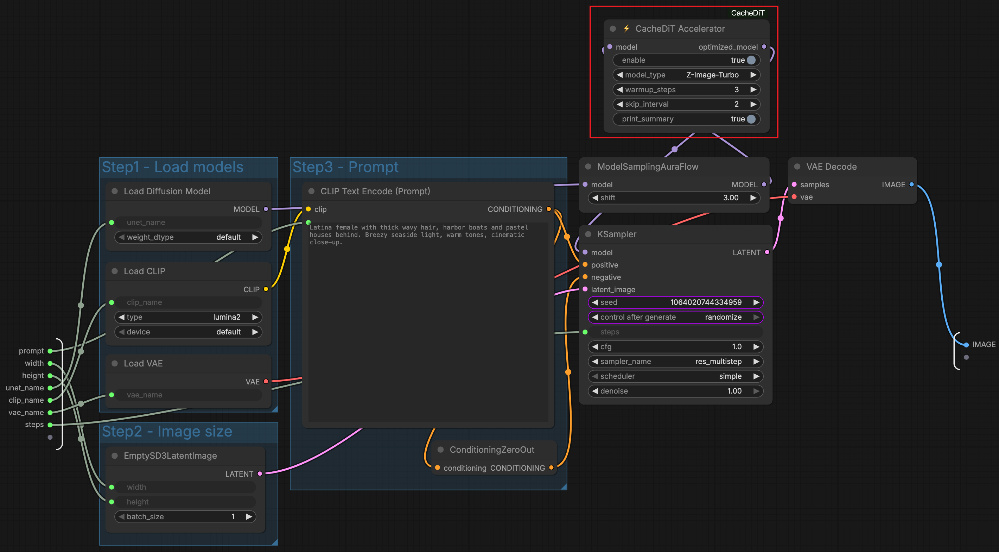

# ComfyUI Portable Setup for Intel XPU (Windows)

This guide provides step-by-step instructions for setting up a portable ComfyUI environment with Intel XPU support on Windows systems.

## Table of Contents

- [Overview](#overview)
- [Prerequisites](#prerequisites)
- [Installation](#installation)
- [Running ComfyUI](#running-comfyui)
- [Installed Custom Nodes](#installed-custom-nodes)
- [Cache-DiT Acceleration](#cache-dit-acceleration)
- [Troubleshooting](#troubleshooting)
- [FAQ](#faq)

---

## Overview

This setup script creates a portable ComfyUI directory layout optimized for Intel XPU (Arc GPUs). The installation includes:

- **Python 3.12 Embedded** - Self-contained Python environment
- **PyTorch with XPU Support** - Intel GPU acceleration
- **omni_xpu_kernel** - Local wheel installed from the llm-scaler build output
- **ComfyUI** - AI image generation workflow interface
- **Essential Custom Nodes** - Pre-installed plugins for extended functionality

### Key Features

- **Portable** - No system-wide installation required
- **Intel XPU Optimized** - Hardware-accelerated on Intel GPUs
- **Pre-configured** - Ready to use out of the box
- **Custom Nodes Included** - Popular extensions pre-installed

## Script Scope And Validated Follow-Up

`setup_portable_env.bat` does not build `omni_xpu_kernel`. It only consumes a prebuilt local wheel and installs it into the embedded Python environment.

In the validated Windows flow, the work was split into two parts:

1. Pre-build `omni_xpu_kernel` separately from `llm-scaler\omni\omni_xpu_kernel` and place the wheel under `<WHEEL_DIR>`.
2. Run `setup_portable_env.bat` from `llm-scaler\omni\comfyui_windows_setup`.
3. Let the setup script install Python, PyTorch XPU, the prebuilt local wheel, ComfyUI, the patch, custom nodes, and launcher scripts.
4. After the script completes, run manual verification from the embedded Python environment.
5. After the script completes, optionally configure `extra_model_paths.yaml` and run an end-to-end workflow test.

The shared model directory and the Z-Image-Turbo workflow test were post-install validation steps. They were not created by the setup script itself.

In the examples below, these placeholders are used:

```text
<WORKSPACE>         workspace root directory
<PORTABLE_DIR>      <WORKSPACE>\llm-scaler\omni\comfyui_windows_setup
<WHEEL_DIR>         <WORKSPACE>\llm_scaler_dist
<SHARED_MODELS_DIR> shared model directory used across ComfyUI installs
```

### Validated Windows Layout

The current validated workspace uses the following paths:

```text
<PORTABLE_DIR>\ComfyUI
<PORTABLE_DIR>\python_embeded
<WHEEL_DIR>\omni_xpu_kernel-0.1.0-cp312-cp312-win_amd64.whl
<SHARED_MODELS_DIR>
```

The portable Python executable is:

```text
<PORTABLE_DIR>\python_embeded\python.exe
```

---

## Prerequisites

### 1. Install Git for Windows

1. Download Git from [git-scm.com](https://git-scm.com/download/win)
2. Run the installer with default options
3. Verify installation by opening Command Prompt and running:
   ```cmd
   git --version
   ```

### 2. (Optional) Configure Proxy

If you are behind a corporate proxy, edit `setup_portable_env.bat` before running:

```batch
REM Uncomment and modify these lines:
set "HTTP_PROXY=http://your-proxy-server:port"
set "HTTPS_PROXY=http://your-proxy-server:port"
set "NO_PROXY=localhost,127.0.0.1"
```

---

## Installation

### Step 1: Download Setup Files

Clone the LLM Scaler repository to your desired location:

```cmd
git clone https://github.com/intel/llm-scaler.git
cd llm-scaler\omni\comfyui_windows_setup
```
The required files are located in:
```
llm-scaler\omni\
├── comfyui_windows_setup\
│   └── setup_portable_env.bat
└── patches\
   └── comfyui_for_multi_arc.patch
```

### Step 2: Run Setup Script

Before running the setup script, make sure the `omni_xpu_kernel` wheel has already been built. The setup script installs that wheel, but it does not build it.

1. **Right-click** on `setup_portable_env.bat`
2. Select **"Run as administrator"** (recommended)
3. Wait for the installation to complete (15-30 minutes depending on internet speed)

The script will automatically:
- Download and configure Python 3.12 Embedded
- Install PyTorch with Intel XPU support
- Install the local `omni_xpu_kernel` wheel built from `llm-scaler\omni\omni_xpu_kernel`
- Clone ComfyUI from official repository
- Apply Intel XPU optimization patches
- Install essential custom nodes
- Create launcher scripts

The setup script expects the local kernel wheel at:

```text
<WHEEL_DIR>\omni_xpu_kernel-0.1.0-cp312-cp312-win_amd64.whl
```

To use a different wheel, set `OMNI_XPU_KERNEL_WHEEL` before running the script:

```cmd
set "OMNI_XPU_KERNEL_WHEEL=D:\path\to\omni_xpu_kernel-0.1.0-cp312-cp312-win_amd64.whl"
setup_portable_env.bat
```

If your network cannot reach `python.org`, place the embedded Python package under the local fallback source directory used by the script and rerun setup. The validated installation used a local embedded Python fallback instead of downloading Python from the public site.

### Step 3: Verify Installation

After installation, navigate to the `comfyui_windows_setup` folder and verify that everything is set up correctly:

```cmd
python_embeded\python.exe -c "import torch; print(f'XPU available: {torch.xpu.is_available()}')"
```

Expected output:
```
XPU available: True
```

Verify the local XPU kernels wheel is installed and loadable:

```cmd
python_embeded\python.exe -c "import omni_xpu_kernel as ok; print(ok.__version__); print(ok.is_available())"
```

Expected output:
```text
0.1.0
True
```

You can also verify that ComfyUI itself imports from the embedded environment:

```cmd
cd ComfyUI
..\python_embeded\python.exe -c "import main; print('ComfyUI main import: OK')"
```

The validated environment also showed:

```text
torch 2.9.0+xpu
torch.xpu.is_available() == True
omni_xpu_kernel 0.1.0
omni_xpu_kernel.is_available() == True
```

---

## Running ComfyUI

### Standard Mode

Double-click `run_comfyui.bat` to start ComfyUI with default settings.

```cmd
run_comfyui.bat
```

> **Note**: The first launch will take longer time for initialization and dependency checking. Please be patient.

### Disable Smart Memory Mode

For GPUs with Out of Memory (OOM), use the low VRAM launcher created by the script:

```cmd
run_comfyui_lowvram.bat
```

### CPU Mode

To run on CPU only (no GPU acceleration):

```cmd
run_comfyui_cpu.bat
```

### Custom Arguments

You can pass additional arguments to any launcher:

```cmd
run_comfyui.bat --listen 0.0.0.0 --port 8188
```

### Accessing the Web Interface

Once ComfyUI starts, open your web browser and navigate to:

```
http://127.0.0.1:8188
```

If port `8188` is already in use, start ComfyUI on another port:

```cmd
run_comfyui.bat --listen 127.0.0.1 --port 8190
```

The validated manual launch command is:

```cmd
set "PYTHONNOUSERSITE=1"
set "PYTHONPATH="
set "PYTHONHOME="
set "PATH=%CD%\python_embeded;%CD%\python_embeded\Scripts;%CD%\python_embeded\Library\bin;%PATH%"
cd ComfyUI
..\python_embeded\python.exe main.py --listen 127.0.0.1 --port 8190
```

---

## Installed Custom Nodes

The setup script automatically installs the following custom nodes:

| Node | Description | Repository |
|------|-------------|------------|
| **ComfyUI-Manager** | Plugin manager for easy node installation | [ltdrdata/ComfyUI-Manager](https://github.com/ltdrdata/ComfyUI-Manager) |
| **VideoHelperSuite** | Video processing and generation tools | [Kosinkadink/ComfyUI-VideoHelperSuite](https://github.com/Kosinkadink/ComfyUI-VideoHelperSuite) |
| **Easy-Use** | Simplified workflow nodes | [yolain/ComfyUI-Easy-Use](https://github.com/yolain/ComfyUI-Easy-Use) |
| **ControlNet Aux** | ControlNet preprocessors | [Fannovel16/comfyui_controlnet_aux](https://github.com/Fannovel16/comfyui_controlnet_aux) |
| **ComfyUI-GGUF-XPU** | XPU-oriented GGUF model format support | [analytics-zoo/ComfyUI-GGUF-XPU](https://github.com/analytics-zoo/ComfyUI-GGUF-XPU) |
| **KJNodes** | Utility nodes collection | [kijai/ComfyUI-KJNodes](https://github.com/kijai/ComfyUI-KJNodes) |
| **ComfyUI-CacheDiT** | DiT model inference acceleration via caching | [Jasonzzt/ComfyUI-CacheDiT](https://github.com/Jasonzzt/ComfyUI-CacheDiT) |

### Cache-DiT Acceleration

[Cache-DiT](https://github.com/vipshop/cache-dit) accelerates diffusion model inference by caching and reusing intermediate DiT block outputs across denoising steps, skipping redundant computation without retraining. The ComfyUI integration is provided by the pre-installed **ComfyUI-CacheDiT** node.

#### Supported Models

| Category | Models |
|----------|--------|
| **Image** | Z-Image, Z-Image-Turbo, Qwen-Image-2512, Flux.2 Klein 4B / 9B |
| **Video** | LTX-2 T2V / I2V, Wan2.2 14B T2V / I2V |

#### Usage

Insert the `⚡ CacheDiT Accelerator` node **between** the model loader and the sampler:



> **Note:** Cache-DiT is best suited for workflows with ≥ 8 steps.

### Installing Additional Nodes

Use ComfyUI-Manager (pre-installed) to install additional custom nodes:

1. Open ComfyUI in your browser
2. Click **"Manager"** button in the menu
3. Select **"Install Custom Nodes"**
4. Search and install desired nodes

---

## Directory Structure

After installation, your `comfyui_windows_setup` directory will look like:

```
comfyui_windows_setup/
├── python_embeded/          # Python environment
│   ├── python.exe
│   ├── Lib/
│   │   └── site-packages/   # Installed packages
│   └── ...
├── ComfyUI/                  # ComfyUI application
│   ├── main.py
│   ├── custom_nodes/         # Custom nodes
│   │   ├── comfyui-manager/
│   │   ├── comfyui-videohelpersuite/
│   │   ├── comfyui-easy-use/
│   │   ├── comfyui_controlnet_aux/
│   │   ├── ComfyUI-GGUF-XPU/
│   │   ├── ComfyUI-KJNodes/
│   │   └── ComfyUI-CacheDiT/
│   ├── models/               # Model files (download separately)
│   │   ├── checkpoints/
│   │   ├── loras/
│   │   ├── vae/
│   │   └── ...
│   ├── input/                # Input images
│   └── output/               # Generated images
├── run_comfyui.bat           # Standard launcher
├── run_comfyui_lowvram.bat   # Low VRAM launcher
└── run_comfyui_cpu.bat       # CPU-only launcher
```

---

## Portable ZIP Reuse

This directory can be packaged as a portable ZIP, but the current validated layout is not fully self-contained for arbitrary Windows machines.

What is already portable:

- `python_embeded/` is self-contained.
- `ComfyUI/` and the generated launcher scripts use relative paths.
- `run_comfyui.bat`, `run_comfyui_lowvram.bat`, and `run_comfyui_cpu.bat` can run from the extracted directory without reinstalling Python.

What is not fully self-contained today:

- The current `ComfyUI\extra_model_paths.yaml` points to `<SHARED_MODELS_DIR>`, which is a machine-specific absolute path in the validated setup.
- The validated Z-Image-Turbo test used models stored outside this directory.
- `omni_xpu_kernel` on Windows still probes Intel oneAPI runtime directories such as `C:\Program Files (x86)\Intel\oneAPI\dnnl\latest\bin` and `C:\Program Files (x86)\Intel\oneAPI\compiler\latest\bin` when importing the native extension.

Practical recommendation:

1. If you want a ZIP for direct unzip testing on another machine, copy the required models into `ComfyUI\models\...` inside this directory and remove or rewrite `ComfyUI\extra_model_paths.yaml`.
2. Use a target machine that already has the required Intel GPU driver. If the packaged environment does not include every DLL needed by `omni_xpu_kernel`, the target machine may also need a compatible Intel oneAPI runtime.
3. Treat the ZIP as portable between similarly prepared Intel XPU Windows machines, not as a fully dependency-free package for any clean Windows host.

For the current workspace, the directory is portable enough for internal testing after fixing the model path assumptions, but it should not yet be described as a completely standalone redistributable package.

---

## Shared Model Directory

The setup script does not create shared model paths automatically. For multiple ComfyUI checkouts, you can optionally use a shared model directory instead of copying large model files into each installation. The validated shared directory is:

```text
<SHARED_MODELS_DIR>
```

Recommended subdirectories:

```text
checkpoints
clip
clip_vision
configs
controlnet
diffusion_models
embeddings
loras
text_encoders
upscale_models
vae
vae_approx
```

Create `ComfyUI\extra_model_paths.yaml` with:

```yaml
shared_models:
   base_path: <SHARED_MODELS_DIR>
   checkpoints: checkpoints
   clip: clip
   clip_vision: clip_vision
   configs: configs
   controlnet: controlnet
   diffusion_models: diffusion_models
   embeddings: embeddings
   loras: loras
   text_encoders: text_encoders
   upscale_models: upscale_models
   vae: vae
   vae_approx: vae_approx
```

The Z-Image-Turbo validation used these model files:

```text
<SHARED_MODELS_DIR>\text_encoders\qwen_3_4b.safetensors
<SHARED_MODELS_DIR>\vae\ae.safetensors
<SHARED_MODELS_DIR>\diffusion_models\z_image_turbo_bf16.safetensors
```

---

## Z-Image-Turbo E2E Validation

This was a manual post-install validation step after the script had completed successfully. The local installation was validated with the official Z-Image-Turbo node chain expanded into a ComfyUI API prompt:

```text
UNETLoader -> ModelSamplingAuraFlow -> KSampler -> VAEDecode -> SaveImage
CLIPLoader -> CLIPTextEncode -> ConditioningZeroOut
EmptySD3LatentImage -> KSampler
```

Validated settings:

```text
unet_name: z_image_turbo_bf16.safetensors
clip_name: qwen_3_4b.safetensors
clip type: lumina2
vae_name: ae.safetensors
shift: 3.0
sampler: res_multistep
scheduler: simple
cfg: 1.0
steps: 4
size: 512x512
```

The test output was generated at:

```text
ComfyUI\output\z_image_turbo_e2e_00001_.png
```

The generated PNG was verified as a valid `512x512` image. The first run loaded about 11.7 GB of model weights and completed in about 57 seconds on the validated Intel XPU system.

---

## Troubleshooting

### Common Issues

#### 1. "XPU not available" Error

**Symptom**: PyTorch reports `XPU available: False`

**Solutions**:
- Try reinstalling PyTorch XPU:
  ```cmd
  python_embeded\python.exe -m pip install torch==2.9.0 torchvision==0.24.0 torchaudio==2.9.0 --index-url https://download.pytorch.org/whl/xpu --force-reinstall
  ```

#### 2. "Git not found" Error

**Symptom**: Setup script fails with "Git is not installed"

**Solution**:
- Install Git from [git-scm.com](https://git-scm.com/download/win)
- Restart Command Prompt after installation
- Verify with `git --version`

#### 3. Out of Memory (OOM) Error

**Symptom**: ComfyUI crashes during generation with memory errors

**Solutions**:
- Use `run_comfyui_lowvram.bat` launcher
- Reduce image resolution
- Close other GPU-intensive applications
- Enable model offloading in workflow settings

#### 4. Patch Application Failed

**Symptom**: Warning about patch already applied or conflicts

**Solutions**:
- This is usually safe to ignore if ComfyUI runs correctly
- For fresh installation, delete `ComfyUI` folder and re-run setup

#### 5. Network/Proxy Issues

**Symptom**: Downloads fail or timeout

**Solutions**:
- Configure proxy settings in the batch file
- Check firewall settings
- Try running with VPN disabled (or enabled, depending on your network)

#### 6. ComfyUI-Manager GitHub Timeout During Startup

**Symptom**: Startup logs show `Cannot connect to host raw.githubusercontent.com` or `Cannot connect to comfyregistry`.

**Solution**:
- This is usually not fatal for local inference.
- ComfyUI-Manager can fall back to local mode.
- Configure proxy variables if you need Manager online features.

#### 7. `comfy-aimdo` DLL Warning

**Symptom**: Startup logs show `comfy-aimdo failed to load`.

**Solution**:
- This package is NVIDIA-only in the current environment.
- The warning can be ignored for Intel XPU validation.

#### 8. Port Already in Use

**Symptom**: Startup fails with `WinError 10048` for `127.0.0.1:8188`.

**Solution**:
- Use another port, for example `--port 8190`.
- Check the current listener with:
   ```powershell
   Get-NetTCPConnection -LocalPort 8188 -ErrorAction SilentlyContinue
   ```

### Getting Help

If you encounter issues not covered above:

1. Check ComfyUI logs in the terminal window for detailed error messages
2. Search existing issues:
   - [ComfyUI GitHub Issues](https://github.com/comfyanonymous/ComfyUI/issues) - For general ComfyUI problems
   - [LLM Scaler Issues](https://github.com/intel/llm-scaler/issues) - For Intel XPU specific issues
3. Submit a new issue on [LLM Scaler repository](https://github.com/intel/llm-scaler/issues) with:
   - Your system information (GPU model, driver version)
   - Complete error logs from the terminal
   - Steps to reproduce the issue

---

## FAQ

### Q: Can I move the installation to another location?

**A**: Mostly yes for the directory layout itself: the embedded Python environment, ComfyUI checkout, and launcher scripts use relative paths, so the folder can be moved. In the current validated setup, you still need to account for external model paths and, on some systems, additional runtime DLL dependencies as described in [Portable ZIP Reuse](#portable-zip-reuse).

### Q: How do I update ComfyUI?

**A**: 
```cmd
cd ComfyUI
git stash
git fetch origin
git pull
git stash pop
```

> **Note**: After updating, there may be patch conflicts if ComfyUI has significant changes. If the patch fails to apply, you may need to download the latest setup script and patch files, then perform a fresh installation.

### Q: Where should I put my model files?

**A**: For a single installation, place model files in the appropriate subfolders under `ComfyUI/models/`:
- Checkpoints (SDXL, SD1.5, etc.) → `models/checkpoints/`
- LoRA models → `models/loras/`
- VAE files → `models/vae/`
- ControlNet models → `models/controlnet/`

For multiple local ComfyUI installations, prefer the shared directory described in [Shared Model Directory](#shared-model-directory).

### Q: Can I use this with NVIDIA GPU?

**A**: This setup is optimized for Intel XPU. For NVIDIA GPUs, use the standard ComfyUI installation with CUDA support.

### Q: How do I uninstall?

**A**: Simply delete the entire installation folder. No registry entries or system files are modified.

### Q: Is this compatible with ComfyUI workflows from the internet?

**A**: Yes! Standard ComfyUI workflows are fully compatible. Some workflows may require additional custom nodes, which can be installed via ComfyUI-Manager.

---

## Version Information

| Component | Version |
|-----------|---------|
| Python | 3.12.10 |
| PyTorch | 2.9.0+xpu |
| omni_xpu_kernel | 0.1.0 local wheel |
| ComfyUI | Commit 64b8457 |
| Setup Script | v1.0 |

---

## License

This setup script is provided for use with Intel XPU hardware. ComfyUI and its custom nodes are subject to their respective licenses.
