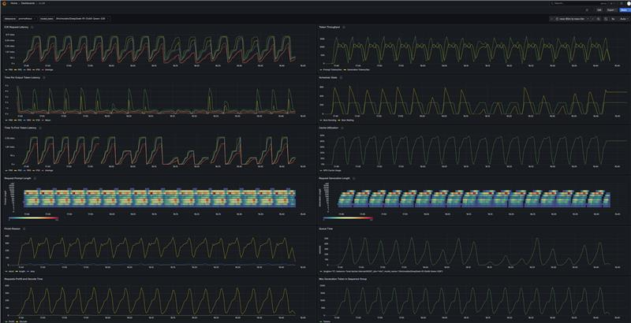

# Monitoring the Service with Prometheus and Grafana

Access http://localhost:8000/metrics to check preprocessed vLLM Prometheus metrics.


Start services prometheus and grafana.

```bash
cd llm-scaler/vllm/monitor
docker compose up # docker-compose.yaml
```

To visualize the metrics, access http://localhost:3000 and log in to the website with default credential(`username:admin`, `password:admin`).


Access http://localhost:3000/connections/datasources/new and select the Prometheus data source to add.


On the `Prometheus` configuration page, you need to add the Prometheus Server URL in the Connection section. In this example setup, Grafana and Prometheus are running in separate containers, but Docker creates a DNS name for each container. You can directly use http://prometheus:9090.


Click Save & Test. You will see a green success message stating:
"Successfully queried the Prometheus API."

Go to http://localhost:3000/dashboard/import, upload the `grafana.json` file, and select the `prometheus` datasource. You will see an interface similar to the following:


These metrics above are essential for monitoring **large language model (LLM) service performance** and **resource utilization**, particularly crucial in streaming generation scenarios (e.g., ChatGPT, API services). Below are detailed explanations and practical implications:

---

#### **1. End-to-End Request Latency (E2E Request Latency)**
- **Definition**: Total time (seconds) from user request submission to complete response receipt.  
- **Significance**: Directly impacts user experience; should be optimized alongside other metrics (e.g., TTFT).  
- **Optimization**: Reduce network latency, model computation time, and queue wait times.

---

#### **2. Time to First Token (TTFT)**
- **Definition**: Duration (P50/P90/P95/P99) from request initiation to first output token generation.  
- **Significance**: Reflects system responsiveness, critical for streaming interaction fluency.  
- **Typical Scenarios**:  
  - High P99 TTFT → Potential cold start issues, computational bottlenecks, or scheduling problems.

---

#### **3. Inter-Token Latency (Time Per Output Token Latency)**
- **Definition**: Time interval (P50/P90/P95/P99) between consecutive output token generations.  
- **Significance**: Measures generation speed stability.  
  - High P99 intervals → Possible memory bandwidth constraints, model complexity issues, or resource contention.

---

#### **4. Request Prompt Length Heatmap**
- **Definition**: Distribution of input prompt lengths (in tokens) correlated with performance metrics (latency/error rates).  
- **Significance**:  
  - Identifies long prompt impacts (e.g., TTFT spikes when >2048 tokens).  
  - Optimizes context window management and caching strategies.

---

#### **5. Finish Reason**
- **Definition**: Termination cause distribution:  
  - **EOS Token**: Natural generation termination.  
  - **Max Sequence Length**: Hit maximum generation limit.  
- **Significance**:  
  - High `Max Sequence Length` ratio → May require length adjustment or generation strategy optimization.

---

#### **6. Token Throughput**
- **Definition**: Tokens processed per second (input + output).  
- **Significance**: Measures overall computational efficiency for hardware planning.  
  - Low throughput → May require batch processing optimization or GPU utilization improvements.

---

#### **7. Scheduler State**
- **Definition**: Request status distribution:  
  - **RUNNING**: Actively computing.  
  - **WAITING**: Queued for resources.  
  - **SWAPPED**: Swapped out of memory (e.g., VRAM exhaustion).  
- **Significance**:  
  - High `WAITING` → Insufficient resources or inefficient scheduling.  
  - Frequent `SWAPPED` → Requires VRAM expansion or memory management optimization.

---

#### **8. Cache Utilization**
- **Definition**: Memory usage percentage of KV Cache in inference engines (e.g., vLLM).  
- **Significance**:  
  - High utilization (>90%) → May trigger cache eviction, increasing latency.  
  - Optimization: Adjust cache size or enable compression.

---

#### **9. Request Generation Length Heatmap**
- **Definition**: Output token length distribution and performance impact analysis.  
- **Significance**:  
  - Identifies long-text generation bottlenecks (e.g., exponential P99 latency growth with length).

---

#### **10. Queue Time**
- **Definition**: Request wait time (seconds) in scheduling queues.  
- **Significance**:  
  - High queue time → Requires horizontal scaling (more instances) or priority strategy optimization.

---

#### **11. Prefill & Decode Time**
- **Definition**:  
  - **Prefill**: Initial computation time for processing input prompts.  
  - **Decode**: Per-token output generation time.  
- **Significance**:  
  - Long Prefill → Needs prompt encoding optimization or hardware upgrades (e.g., FP16 compute).  
  - Long Decode → Potentially memory bandwidth constrained.

---

#### **12. Max Generation Tokens in Sequence Group**
- **Definition**: Maximum allowed generation length for request groups (e.g., batched requests).  
- **Significance**:  
  - Too low → May truncate outputs; Too high → Resource waste or OOM risks.

---

A demo of DeepSeek-R1-Distill-Qwen-32B running for one hour on 4×Arc770 GPUs.

